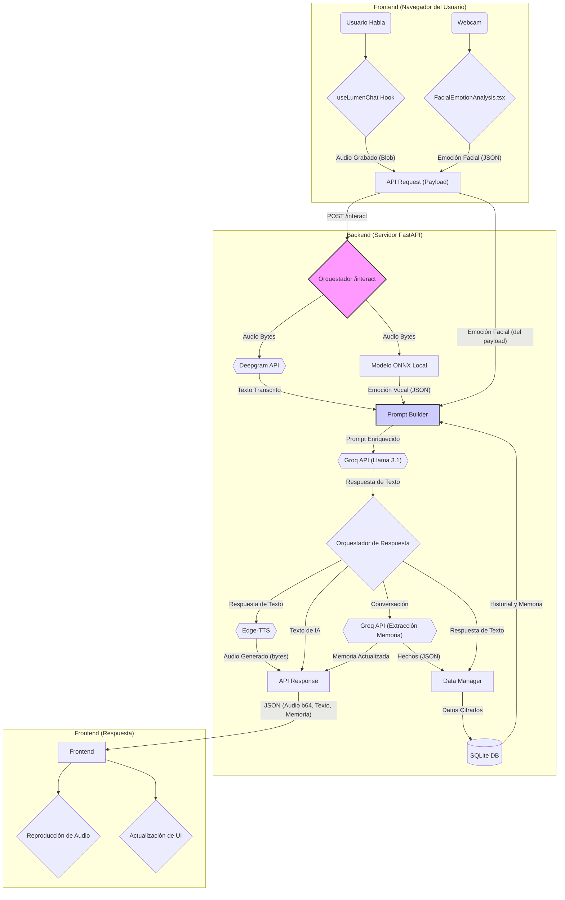

# Flujo de Datos de una Interacción

Esta sección detalla la secuencia de eventos que ocurren desde que un usuario habla hasta que recibe una respuesta de Lumen.

Para visualizar este proceso, se utiliza un **Diagrama de Flujo de la Arquitectura del Sistema**. Este tipo de diagrama es una vista híbrida que muestra cómo los diferentes componentes (frontend, backend, APIs externas) colaboran para manejar una interacción completa. A diferencia de un DFD estricto, este diagrama ilustra tanto el **flujo de datos** (ej. "Audio Bytes" -> "Texto Transcrito") como el **flujo de control** secuencial del proceso.

1.  **Inicio de Sesión (Frontend)**

    - Al cargar la aplicación por primera vez, el frontend verifica si existe un `session_id` en `localStorage`.
    - Si no existe, realiza una petición `POST` al endpoint `/session` del backend para crear una nueva sesión y obtener un `session_id`.

2.  **Entrada de Usuario (Frontend)**

    - El usuario habla. El hook `useLumenChat` gestiona la grabación de audio usando la API `MediaRecorder`.
    - Simultáneamente, si la cámara está activada, `FacialEmotionAnalysis.tsx` analiza el stream de video y mantiene en el estado el resultado emocional más reciente.

3.  **Envío de Solicitud (Frontend -> Backend)**

    - Cuando el usuario termina de hablar, el audio grabado y los datos de emoción facial se combinan en un payload.
    - El frontend envía una petición `POST` al endpoint `/interact` del backend con un JSON que contiene: `session_id`, `audio_b64`, `facial_emotion`, `chat_history` y `long_term_memory`.

4.  **Procesamiento Multimodal (Backend)**

    - El orquestador del endpoint `/interact` recibe la petición y decodifica el audio.
    - **Procesamiento en Paralelo:**
      - El audio se envía a la **API de Deepgram** para su transcripción a texto.
      - Al mismo tiempo, el audio se procesa localmente con el **modelo ONNX** para el análisis de emoción vocal.

5.  **Construcción del Prompt Enriquecido (Backend)**

    - El **Prompt Builder** recopila todas las fuentes de contexto necesarias para generar la respuesta más empática posible:
      - El **Texto Transcrito** de Deepgram.
      - La **Emoción Vocal** analizada por el modelo ONNX.
      - La **Emoción Facial** recibida en el payload del frontend.
      - El **Historial de la Conversación** y la **Memoria a Largo Plazo**, recuperados desde la base de datos **SQLite**.
    - Todos estos elementos se combinan en un único prompt estructurado.

6.  **Generación de Respuesta y Memoria (Backend)**

    - El prompt enriquecido se envía a la **API de Groq**, que devuelve la respuesta de Llama 3.1.
    - Un **Orquestador de Respuesta** recibe este texto y coordina los siguientes pasos:
      - Inicia la síntesis de voz.
      - Envía la conversación completa (pregunta del usuario y respuesta de la IA) a Groq nuevamente, con un prompt específico para **extraer hechos clave** para la memoria.

7.  **Persistencia y Síntesis de Voz (Backend)**

    - El **Data Manager** recibe la respuesta de la IA y los nuevos hechos de memoria (si los hay), los **cifra** y los guarda en la base de datos SQLite.
    - Paralelamente, la respuesta de texto de la IA se convierte en audio usando **Edge-TTS**.
    - Finalmente, se ensambla una **API Response** en formato JSON para el frontend, conteniendo el audio (`b64`), el texto y la memoria actualizada.

8.  **Salida Final (Frontend)**
    - El frontend recibe la respuesta completa del backend.
    - Actualiza su estado interno (mensajes, memoria), lo que provoca una **actualización de la UI**.
    - Decodifica el audio base64 y lo **reproduce automáticamente**, haciendo que Lumen "hable".
